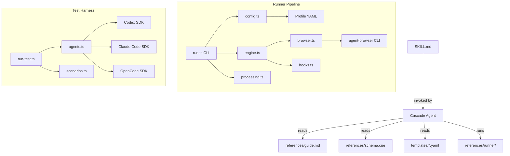
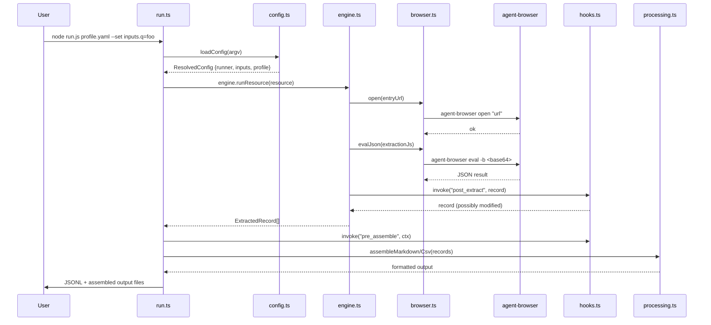

# Design: wise-scraper-v1 (WISE — Web Info Structured Extraction)

## Tech Stack

- **Language**: TypeScript (strict mode, ES2022 target, Node16 module resolution)
- **Runtime**: Node.js 18+
- **Browser backend**: `agent-browser` CLI (Vercel)
- **Schema validation**: CUE (`references/schema.cue`)
- **Config composition**: `convict` (schema + defaults + validation) + `deepmerge` (YAML merge)
- **Post-processing**: `cheerio` (HTML parse), `turndown` (HTML→MD)
- **Testing**: Manual E2E via runner + multi-agent harness
- **Build**: `npx tsc`
- **Lint**: `tsc --noEmit` (strict mode is the linter)

## Directory Structure

```
wise-scraper-skill/
├── SKILL.md                          # ≤ 80 lines, concise
├── AGENTS.md                         # Required skills, conventions
├── README.md                         # Installation + usage
├── .gitignore
├── references/
│   ├── schema.cue                    # CUE schema
│   ├── field-guide.md                # Plain English field descriptions
│   ├── guide.md                      # Full usage guide (moved from SKILL.md)
│   └── runner/
│       ├── package.json
│       ├── tsconfig.json
│       └── src/
│           ├── index.ts
│           ├── types.ts
│           ├── browser.ts
│           ├── engine.ts
│           ├── hooks.ts
│           ├── processing.ts
│           ├── config.ts
│           └── run.ts
├── templates/*.yaml
├── examples/
│   ├── overview.md
│   ├── revspin/
│   └── splunk-itsi-admin/
├── tests/harness/
│   ├── package.json
│   ├── tsconfig.json
│   └── src/
│       ├── agents.ts
│       ├── scenarios.ts
│       └── run-test.ts
└── docs/
    ├── spec.md                       # Informal spec (pre-dates this formal spec)
    └── lessons/
```

## Architecture Overview



## Module Design

### SKILL.md (Req 1)

- **Purpose**: Windsurf skill entry point — triggers on scraping-related requests
- **Interface**: YAML frontmatter (`name`, `description` ≤ 120 chars) + markdown body (≤ 80 lines)
- **Sections**: When to use → Workflow → Core rules → Reference table → Common mistakes
- **Dependencies**: None (it's a markdown file)

### references/guide.md (Req 1.4)

- **Purpose**: Full documentation that SKILL.md body points to
- **Contents**: Profile schema details, extraction rules, hook API, exploration commands, JSONL format, competitive positioning (Req 8)
- **Dependencies**: None

### references/runner/src/config.ts (Req 3)

- **Purpose**: Hydra-like config composition
- **Interface**:
  ```typescript
  function loadConfig(argv: string[]): ResolvedConfig
  interface ResolvedConfig { runner: RunnerConfig; inputs: InputConfig; profile: Record<string, unknown> }
  ```
- **Dependencies**: `convict`, `deepmerge`, `js-yaml`
- **Existing state**: Already implemented and compiles. Needs integration into `run.ts`.

### references/runner/src/run.ts (Req 2, 3)

- **Purpose**: CLI entry point
- **Current interface**: `node dist/run.js <profile.yaml> [--output-dir] [--hooks] [-v]`
- **Target interface**: `node dist/run.js <profile.yaml> [--output-dir] [--hooks] [--set k=v] [--config extra.yaml] [-v] [--dry-run]`
- **Change needed**: Replace hand-rolled `parseArgs()` with `loadConfig()` from `config.ts`. Keep existing profile loading and output writing logic.
- **Dependencies**: All other runner modules

### references/runner/src/engine.ts (Req 2, 5, 6)

- **Purpose**: Profile schema interpreter
- **Interface**: `engine.runResource(resource) → ExtractedRecord[]`
- **Existing state**: Complete — handles selectors, interactions, pagination, matrix, extraction via DOM eval
- **No changes needed** unless bugs surface during E2E validation

### references/runner/src/browser.ts (Req 2, NF 1)

- **Purpose**: `agent-browser` CLI abstraction
- **Interface**: `open()`, `eval()`, `evalJson()`, `click()`, `select()`, `scroll()`, `wait()`, `close()`
- **Existing state**: Complete — base64 eval, retry, cross-platform
- **No changes needed**

### references/runner/src/hooks.ts (Req 2)

- **Purpose**: Extensible hook system
- **Interface**: `register(point, fn, name)`, `invoke(point, ctx)`, `loadFromConfig()`, `loadFromModule()`
- **Existing state**: Complete
- **No changes needed**

### references/runner/src/processing.ts (Req 2)

- **Purpose**: Post-extraction HTML→MD, table→MD, ref extraction, CSV/MD/JSON assembly
- **Interface**: `htmlToMarkdown()`, `htmlTableToMarkdown()`, `extractRefs()`, `cleanHtml()`, `assembleMarkdown()`, `assembleCsv()`
- **Existing state**: Complete
- **No changes needed**

### tests/harness/ (Req 4)

- **Purpose**: Run skill test scenarios against coding agents
- **Interface**: `node dist/run-test.js --agent <name> --scenario <id> --check --list`
- **Existing state**: Skeleton exists, but doesn't compile due to dynamic imports of optional agent SDKs
- **Change needed**: Fix TS compilation by adding type declarations for optional SDK modules (or use `// @ts-ignore` + runtime detection)
- **Dependencies**: `js-yaml`, optional: `@openai/codex-sdk`, `@anthropic-ai/claude-code`, `@opencode-ai/sdk`

## Data Flow



## Error Handling Strategy

- **agent-browser not found**: `BrowserError` with install instructions (already implemented in `browser.ts`)
- **Profile parse failure**: Early exit with clear error message (already in `run.ts`)
- **Invalid config override**: `convict` validates and warns; runner continues with defaults (Req 3.4)
- **Browser timeout**: Retry with backoff (already in `browser.ts`, configurable via `retries`)
- **Hook failure**: Catch, log error, continue with unmodified context (already in `hooks.ts`)
- **Missing optional SDK**: Dynamic import with try/catch returns `false` for `available()` (Req 4.4)

## Testing Strategy

- **Build verification**: `npx tsc` in `references/runner/` — zero errors (Req 2.1, NF 3)
- **Build verification**: `npx tsc` in `tests/harness/` — zero errors (Req 4.1)
- **E2E — Revspin**: Run `node dist/run.js examples/revspin/revspin_durable.yaml` → ≥ 100 records (Req 5.1)
- **E2E — ITSI**: Write full-schema profile, run → ≥ 50 pages discovered (Req 6.1, 6.2)
- **Harness smoke**: `node dist/run-test.js --list` prints scenarios, `--check` probes agents (Req 4.2, 4.3)
- **Template validation**: Parse all `templates/*.yaml` with js-yaml, verify no errors (Req 7.4)
- **SKILL.md validation**: Check frontmatter fields, description length, body line count (Req 1.1–1.3)
- **Test command**: `npx tsc` (both dirs)
- **Coverage target**: N/A (manual E2E, not unit-test driven)

## Constraints

- Runner is **reference material**, not a published npm package
- SKILL.md must be valid per [Windsurf skill spec](https://docs.windsurf.com/windsurf/cascade/skills)
- DOM eval for live-page extraction; `cheerio`/`turndown` only for post-processing
- `agent-browser` is the only browser backend (no Puppeteer/Playwright direct usage)
- Test harness agent SDKs are optional — harness must work with zero SDKs installed

## Correctness Properties

### Property 1: Valid Skill Invocation

- **Statement**: *For any* Windsurf installation with the skill folder, WHEN Cascade scans skills, THEN `SKILL.md` SHALL parse without error and `description` SHALL be ≤ 120 characters
- **Validates**: Requirement 1.1, 1.2
- **Example**: `description: "Structured web scraping via declarative YAML profiles and agent-browser"` (72 chars)
- **Test approach**: String length check + YAML frontmatter parse

### Property 2: Clean Build

- **Statement**: *For any* clean checkout, WHEN `npm install && npx tsc` is run in `references/runner/`, THEN exit code SHALL be 0 with zero diagnostics
- **Validates**: Requirement 2.1, NF 3
- **Test approach**: Run `npx tsc` and assert exit code 0

### Property 3: Config Override Merge

- **Statement**: *For any* profile with `inputs.queries: ["default"]`, WHEN `--set inputs.queries=[a,b,c]` is passed, THEN `resolvedConfig.inputs.queries` SHALL equal `["a","b","c"]`
- **Validates**: Requirement 3.1, 3.3
- **Example**: `loadConfig(["profile.yaml", "--set", "inputs.queries=[a,b,c]"])`
- **Test approach**: Unit-style: call `loadConfig` with mock argv, assert `inputs.queries`

### Property 4: Harness Graceful Degradation

- **Statement**: *For any* environment where no agent SDK is installed, WHEN `--check` is run, THEN it SHALL print availability for each agent without throwing
- **Validates**: Requirement 4.1, 4.3, 4.4
- **Test approach**: Run `--check` in clean environment, assert no unhandled rejections

### Property 5: Revspin Record Count

- **Statement**: *For any* run of the revspin profile with `page_limit: 2`, WHEN extraction completes, THEN `records.length` SHALL be ≥ 100
- **Validates**: Requirement 5.1, 5.2
- **Test approach**: Run profile, count JSONL lines

### Property 6: ITSI Page Discovery

- **Statement**: *For any* run of the full-schema ITSI profile, WHEN discovery completes, THEN ≥ 50 unique page URLs SHALL be found
- **Validates**: Requirement 6.1, 6.2
- **Test approach**: Run profile, count unique URLs in JSONL output

## Decisions

### Decision: Config library

**Context:** Need Hydra-like config composition for Node/TypeScript
**Options Considered:**
1. `convict` + `deepmerge` — Schema-first, defaults, env, validation, mature (Mozilla)
2. `nconf` — Hierarchical, no schema validation
3. `cosmiconfig` — Discovery only, no composition

**Decision:** `convict` + `deepmerge`
**Rationale:** Closest to Hydra's spirit — schema defines valid config, convict enforces types/defaults, deepmerge handles YAML file composition. Already implemented in `config.ts`.

### Decision: Agent SDK integration approach

**Context:** Test harness needs to interface with Codex, Claude Code, and OpenCode
**Options Considered:**
1. Official SDKs as required deps
2. Official SDKs as optional deps + CLI fallback
3. CLI-only (no SDK deps)

**Decision:** Optional deps + CLI fallback
**Rationale:** Not all agents will be available in every environment. Optional deps + dynamic import lets the harness compile and run with zero SDKs installed, while providing richer integration when SDKs are available.

### Decision: SKILL.md body length

**Context:** Current SKILL.md is 243 lines — too heavy for Cascade's context window
**Options Considered:**
1. Keep everything in SKILL.md
2. ≤ 80 lines in SKILL.md, detail in `references/guide.md`

**Decision:** ≤ 80 lines, with `references/guide.md` for full documentation
**Rationale:** Skills should minimize context window cost. Cascade can read supporting files when needed via progressive disclosure.

### Decision: run.ts CLI integration with config.ts

**Context:** `run.ts` has its own `parseArgs()`, `config.ts` has `loadConfig()` — both handle CLI args
**Options Considered:**
1. Replace `parseArgs()` entirely with `loadConfig()`
2. Keep `parseArgs()` for backward compat, add `loadConfig()` as optional

**Decision:** Replace `parseArgs()` with `loadConfig()`
**Rationale:** `loadConfig()` is a superset — it handles everything `parseArgs()` does plus `--set`, `--config`, env vars. One code path is simpler.

## Edge Cases

- **Empty profile**: `loadProfile()` throws with clear message (already handled)
- **agent-browser not installed**: `BrowserError` with install command (already handled)
- **Windows paths in --config**: `resolve()` normalizes (already handled)
- **Invalid --set syntax**: `parseCustomArgs()` skips malformed entries, logs warning
- **Profile with zero selectors**: Engine returns empty array, no crash
- **Stale runner dist/**: User must run `npx tsc` — README documents this
